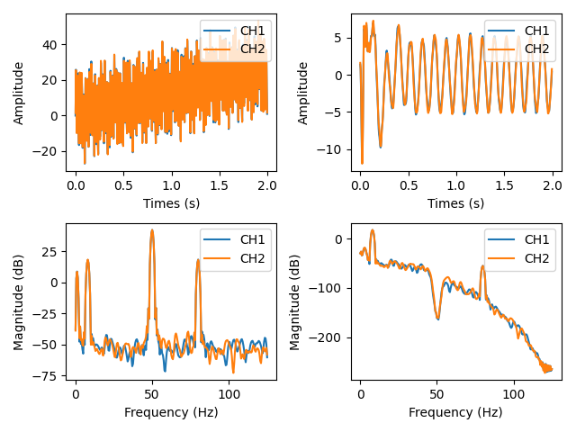

Real-time Multichannel IIR Filter in Python
=============================

Project Overview
--------

This is a IIR filter class which uses the scipy `sosfilt` implementation to achieve the fast computational speed and high stability. The filter is capable of sample by sample multichannel realtime filtering and able to switch between raw mode and filter mode interchangably. Because of the `sosfilt` is implemented in C, the performance is very efficient. This class can be used in multichannel signal filtering such as real-time EEG monitoring system.

Import
------

import IIR filter use the following import:

```python
from iir import IIR
```

Create an instance
------------------

The constructor takes the `num_channels` and `sampling_frequency` as an input parameters:

```python
iir_filter = IIR(
    num_channels=4,
    sampling_frequency=256 #Hz
)
```

Building pipeline
-----------------

Filter can be cascading by using the `add_filter` method. By default, the method constructs a butterworth filter with the same parameter as `scipy.signal.butter` method:

```python
# Add 6th order butterworth bandstop filter with cutoff at 45-55Hz
iir_filter.add_filter(
    order=6, 
    cutoff=(45,55),
    filter_type='bandstop'
)
# Add 2th order butterworth highpass filter with cutoff at 30Hz
iir_filter.add_filter(
    order=2, 
    cutoff=30,
    filter_type='lowpass'
)
```

For other types of filter, using `scipy.signal.iirfilter` method to create sos coefficient array and add to the IIR filter using `add_sos` method.

```python
# Build your own filter
sos = scipy.signal.iirfilter(N=17, Wn=[50, 200], 
    rs=60, btype='band', analog=False, ftype='cheby2', fs=2000,
    output='sos')

iir_filter.add_sos(sos)
```
Filtering
---------
The samples array is arranged in dimension of (N samples x M channels).
```python
raw_samples = [
    [CH1[0],CH2[0],...,CHM[0]],
    [CH1[1],CH2[1],...,CHM[1]],
    [CH1[2],CH2[2],...,CHM[2]],
    ...
    [CH1[N],CH2[N],...,CHM[N]],
]
```
We can filter raw signals directly by calling `filter` method.
```python
filt_samples = iir_filter.filter(raw_samples)
```

 The state of the filter is remembered, so the next samples can be filtered by calling `filter` method over and over.
```python
filt_first_chunk  = iir_filter.filter(raw_first_chunk)
filt_second_chunk = iir_filter.filter(raw_second_chunk)
filt_third_chunk  = iir_filter.filter(raw_third_chunk)
```

Raw mode
---------
When testing a system, sometimes we want to check the raw signal without filtering. By using `set_raw_mode` method, we can bypass filtering operation in `filter` method. This is useful when you want to observe the raw signal quality by simply adding one line of code.
```python
#Get filtered output
filt_samples = iir_filter.filter(raw_samples)

#Set to raw mode
iir_filter.set_raw_mode(True)

#Get the output the same as input
raw_samples = iir_filter.filter(raw_samples)
```

Examples
--------
You can try running an example.py file to see the signal and frequency content plot before and after `filter`. 
```powershell
python examples.py
```

Two channel raw signals are generated as a combination of amplitude and frequency of:
- 200 @0.01Hz
- 5 @8Hz
- 20 @50Hz
- 2 @80Hz
  
The filter specification in example.py script are:
```python
iir_filter = IIR(
    num_channel= 2,
    sampling_frequency= 250
)
iir_filter.add_filter(order=6, cutoff=(45, 55), filter_type='bandstop')
iir_filter.add_filter(order=4, cutoff=40, filter_type='lowpass')
iir_filter.add_filter(order=4, cutoff=3, filter_type='highpass')
```


The results of filtering is shown in below figure:


Acknowledgement
---------------
This project is inspired by [py-iir-filter](https://github.com/berndporr/py-iir-filter) repository of [@berndporr](https://github.com/berndporr)